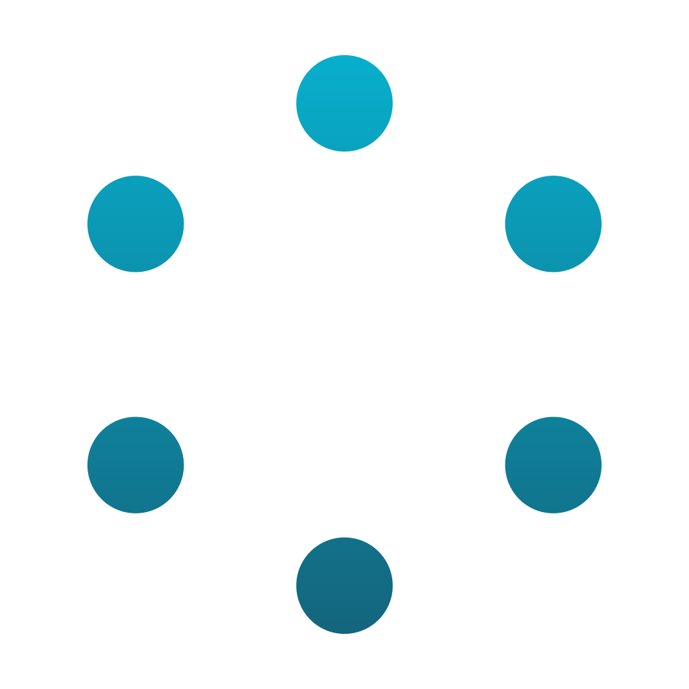
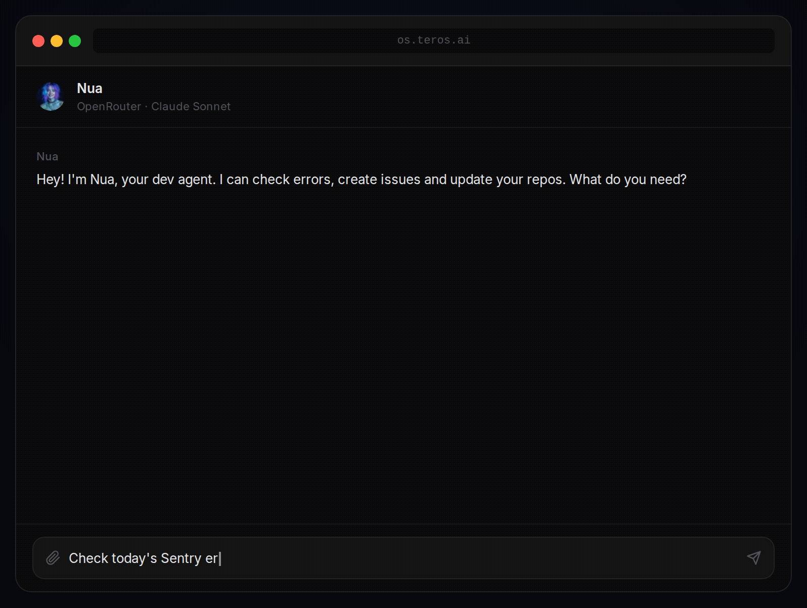

<div align="center">



# Teros

**The open-source AI agent operating system.**

Build, run, and extend AI agents that actually get things done.

[](https://github.com/teros-hq/teros/stargazers)
[](./LICENSE)
[](https://github.com/teros-hq/teros/issues)

[](https://www.typescriptlang.org/)
[](https://nodejs.org/)
[](https://www.mongodb.com/)
[](https://reactnative.dev/)
[](https://expo.dev/)

[Website](https://teros.ai) · [Documentation](https://github.com/teros-hq/teros/tree/main/docs) · [Contributing](./CONTRIBUTING.md)

```bash
curl -fsSL https://get.teros.ai | bash
```

*Requires Docker. Takes ~2 minutes.*

</div>

---

<div align="center">
  
  <p><em>Nua reads Sentry errors and creates Linear issues automatically</em></p>
</div>

---

## What is Teros?

Teros is an open-source platform for building and running **AI agents with real tool capabilities**. Think of it as an operating system for AI — agents live inside it, have access to tools (MCAs), connect to your services, and work for you across tasks.

Unlike chat wrappers, Teros agents are **persistent, multi-tool, and autonomous**. They can browse the web, write and run code, manage your calendar, send emails, interact with GitHub, deploy to Railway, and much more — all through a clean, extensible architecture.

```
You talk to an agent → The agent uses tools → Things actually happen
```

---

## Key Concepts

### 🤖 Agents
AI personas with a personality, memory, and access to tools. Each agent has its own system prompt, preferred LLM provider, and set of installed apps. You can have multiple agents for different purposes — a coding assistant, a project manager, a research agent.

### 🔧 MCAs (Model Context Apps)
The tool system. An MCA is a self-contained package that gives agents new capabilities — file system access, email, calendar, databases, APIs. Teros ships with **43 MCAs** out of the box and makes it easy to build your own.

### 🏗️ Workspaces
Shared environments where agents and apps are organized together. A workspace can have multiple agents collaborating on the same project, with shared context and board-based task management.

### 🧠 Providers
LLM backends. Teros supports Anthropic, OpenAI, OpenRouter, Ollama (local), Zhipu, and OAuth-based providers like Claude Max and ChatGPT Pro/Plus (Codex). Each agent can use a different model.

---

## Architecture

```
┌──────────────────────────────────────────────────────────────────┐
│                           Teros                                  │
│                                                                  │
│   ┌──────────────┐   WebSocket   ┌──────────────────┐            │
│   │   Frontend   │ ◄──────────── │    Backend       │            │
│   │  React Native│ ──────────── ►│    Node.js       │            │
│   │  (Expo Web)  │               │    WsRouter      │            │
│   └──────────────┘               └───────┬──────────┘            │
│                                          │                       │
│                             ┌────────────┼─────────────┐         │
│                             │            │             │         │
│                        ┌────▼────┐  ┌────▼────┐  ┌─────▼─────┐   │
│                        │ MongoDB │  │  MCAs   │  │   LLM     │   │
│                        │         │  │ (tools) │  │ Providers │   │
│                        └─────────┘  └─────────┘  └───────────┘   │
│                                                                  │
└──────────────────────────────────────────────────────────────────┘
```

### Monorepo Structure

```
teros/
├── packages/
│   ├── app/          # React Native / Expo frontend
│   ├── backend/      # Node.js WebSocket server
│   ├── core/         # LLM adapters, conversation engine
│   ├── shared/       # Protocol types, Zod schemas
│   └── mca-sdk/      # SDK for building MCAs
│
├── mcas/             # 43 ready-to-use tool packages
│   ├── mca.teros.bash
│   ├── mca.teros.filesystem
│   ├── mca.teros.memory
│   ├── mca.google.gmail
│   ├── mca.google.calendar
│   ├── mca.github
│   ├── mca.notion
│   ├── mca.linear
│   └── ... (43 total)
│
├── docs/             # Architecture, RFCs, runbooks
└── scripts/          # Build and sync utilities
```

---

## Included MCAs

Teros ships with 43 MCAs across several categories:

**Productivity**
`gmail` · `google-calendar` · `google-drive` · `google-contacts` · `microsoft-outlook` · `notion` · `todoist` · `trello` · `monday` · `linear`

**Development**
`github` · `railway` · `sentry` · `docker-env` · `bash` · `filesystem` · `playwright`

**AI & Media**
`replicate` · `higgsfield` · `elevenlabs` · `perplexity` · `file-processor`

**Platform**
`memory` · `scheduler` · `conversations` · `board-manager` · `board-runner` · `messaging` · `webfetch` · `datetime`

**Integrations**
`canva` · `figma` · `intercom` · `homey` · `minio` · `kelify`

---

## LLM Providers

| Provider | Models |
|---|---|
| Anthropic | Claude 3.5, Claude 3.7, Claude 4 |
| OpenAI | GPT-4o, GPT-5, o3, o4-mini |
| OpenAI Codex | gpt-5.4, gpt-5.3-codex, gpt-5.2-codex, gpt-5.1-codex... |
| OpenRouter | 400+ models |
| Ollama | Any locally installed model |
| Zhipu AI | GLM-4 |
| Google | Gemini 2.5 Pro/Flash |
| xAI | Grok 3, Grok 3 Mini |

---

## Quick Start

### Prerequisites
- Docker and Docker Compose

### Run

```bash
git clone https://github.com/teros-hq/teros.git
cd teros
cp .env.example .env
bash scripts/setup-secrets.sh
docker compose up
```

Open [http://localhost:10002](http://localhost:10002).

### Development setup

```bash
# Install dependencies
yarn install

# Build all packages
yarn build

# Start MongoDB
docker compose up -d mongodb

# Terminal 1 — backend (with hot reload)
yarn dev:backend

# Terminal 2 — frontend
yarn dev:app
```

---

## Building an MCA

An MCA is a directory with a `manifest.json`, a `tools.json` (auto-generated), and a `src/` folder. Each tool lives in its own file. The MCA SDK handles the HTTP transport and connection to the backend automatically.

```
mcas/mca.my-tool/
├── manifest.json        # Metadata, secrets, availability, runtime config
├── tools.json           # Tool schemas (auto-generated by sync script)
├── package.json
├── tsconfig.json
└── src/
    ├── index.ts         # McaServer setup, tool registration, server.start()
    ├── lib/             # API client, auth helpers, shared utilities
    └── tools/
        ├── index.ts     # Re-exports all tools
        ├── my-tool.ts   # One file per tool
        └── other-tool.ts
```

```typescript
// src/tools/my-tool.ts
import type { HttpToolConfig as ToolConfig } from '@teros/mca-sdk';

export const myTool: ToolConfig = {
  description: 'Does something useful',
  parameters: {
    type: 'object',
    properties: {
      query: { type: 'string', description: 'The query to process' },
    },
    required: ['query'],
  },
  handler: async (args, context) => {
    const { query } = args as { query: string };
    // context.getUserSecrets() — fetch API keys configured by the user
    return { result: `You asked: ${query}` };
  },
};
```

```typescript
// src/index.ts
import { McaServer } from '@teros/mca-sdk';
import { myTool } from './tools';

const server = new McaServer({ id: 'mca.my-tool', name: 'My Tool', version: '1.0.0' });

server.tool('my-tool', myTool);

server.start();
```

See [CONTRIBUTING.md](./CONTRIBUTING.md) for the full MCA development guide.

---

## Tech Stack

| Layer | Technology |
|---|---|
| Frontend | React Native (Expo), Tamagui, Zustand, Expo Router |
| Backend | Node.js, TypeScript, `ws`, Zod |
| Database | MongoDB 7.0 |
| LLM Core | Custom adapters per provider |
| Infrastructure | Docker, Docker Compose |
| Monorepo | Yarn Workspaces |

---

## Contributing

Teros is open source and contributions are welcome.

```bash
# Fork, clone, create a branch
git checkout -b feat/my-feature

# Make changes, test locally
yarn dev:backend

# Submit a PR
```

See [CONTRIBUTING.md](./CONTRIBUTING.md) for guidelines, code style, and how to build and submit new MCAs.

---

## License

[FSL-1.1-Apache-2.0](./LICENSE) — free for personal and non-commercial use. Converts to Apache 2.0 on the second anniversary of each release.

---

<div align="center">
  Built with ❤️ by <strong>@supertowers</strong> · <a href="https://github.com/supertowers">GitHub</a> · <a href="https://twitter.com/supertowers">X</a>
</div>
